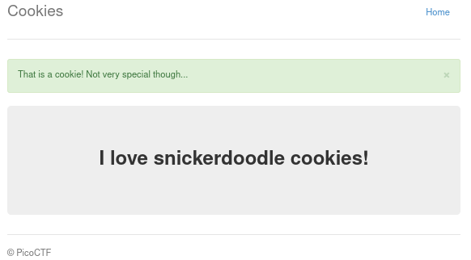
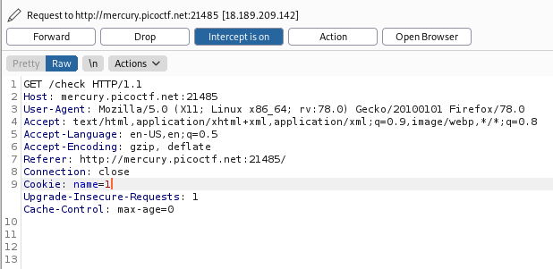
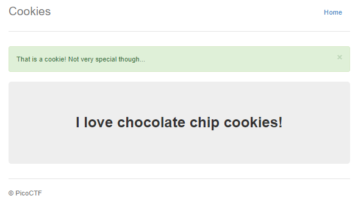
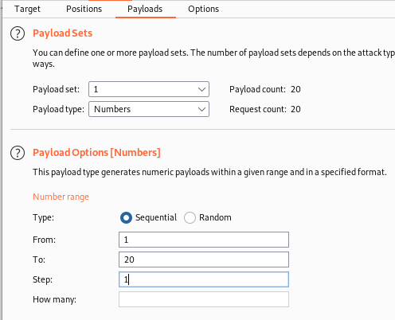
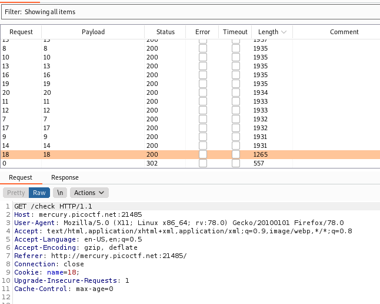
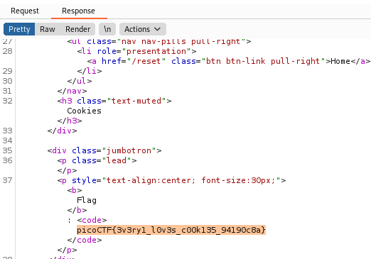

# Cookies

Category: Web Exploitation
</br>
AUTHOR: MADSTACKS

## Description
```
Who doesn't love cookies? Try to figure out the best one.
```

## Looking at the website

Opening up the given link we are welcomed by the following page:
</br>


</br>

Good, so we can search for cookies. I fired up `BurpSuite` right away, entered `snickerdoodle` and sent it away! After I got a response from the server my web cookie changed
```
name=0
```
And this appeared:
</br>



</br>

## Burping

Interesting, we started out at `name=-1`. I wonder if the cookies are in a sequence? I changed my cookie in Burp to `name=1`. Like so: 

</br>



</br>

Sent it with forward and click through to the response. 

</br>



</br>

Awesome! Now we can go through with intruder. Set a list like so:

</br>



</br>

Now just fire away! Responses are coming in now, so just sort by `length` and look for the odd one out. I found this:

</br>



</br>

Could this one be it? 

</br>



</br>
And indeed it is! It might look nicer on the webpage, but this is could enough :)

```
picoCTF{3v3ry1_l0v3s_c00k135_94190c8a}
```