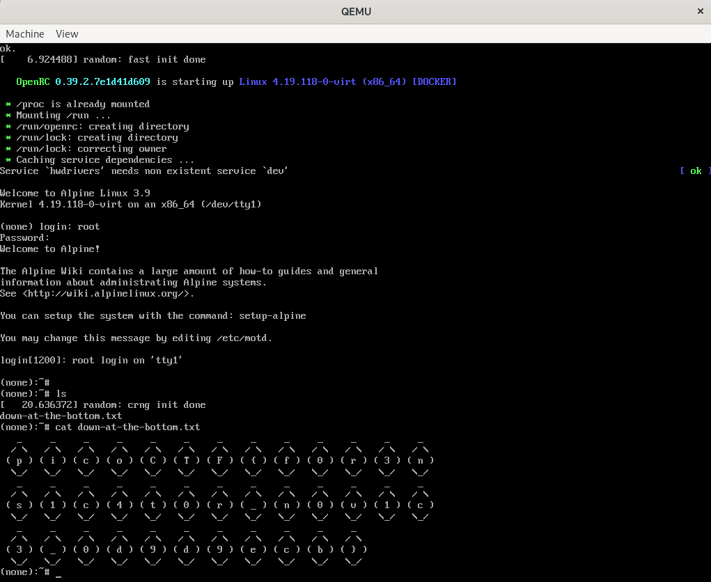

# Disk,disk,sleuth! II

Category: Forensics </br>
AUTHOR: SYREAL

**Disclaimer! I do not own any of the challenge files!**

## Description
```
All we know is the file with the flag is named `down-at-the-bottom.txt`... 
Disk image: dds2-alpine.flag.img.gz
```

## Poking around

So just like last time, I ran `srch_strings`:
```
srch_strings dds2-alpine.flag.img | grep pico
ffffffff81399ccf t pirq_pico_get
ffffffff81399cee t pirq_pico_set
ffffffff820adb46 t pico_router_probe
```
But nothing this time... maybe some other tools? I tried playing around with the GUI version of tsk `Autopsy`. But it didn't help... so I decided to just install qemu and try and boot into the img from there.

## qemu

Installation (on Kali/Debian): `apt-get install qemu-kvm`
</br></br>
Then I just ran `qemu-system-x86_64 dds2-alpine.flag.img`. The image booted up, and I searched for `down-at-the-bottom.txt`:

</br>



</br>

`picoCTF{f0r3ns1c4t0r_n0v1c3_0d9d9ecb}` Great! 
