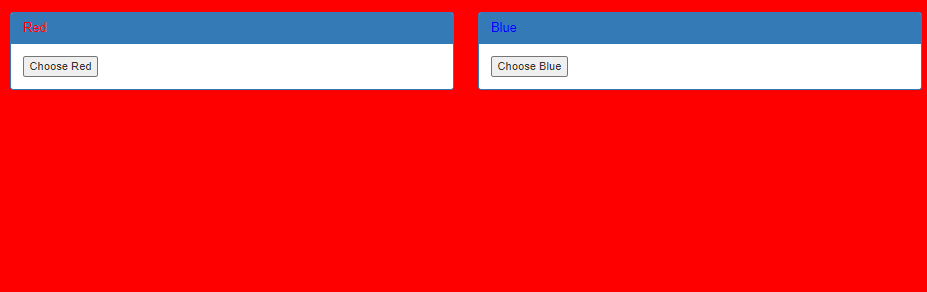

# Get aHEAD

AUTHOR: MADSTACKS

##Description

```
Find the flag being held on this server to get ahead of the competition
```

## Solution

Opening up the website we can see the following: 
</br>



</br>

Okay, so we can change the colour of the page. But what use is that to us? Maybe there is something in the source code.
```html
<!doctype html>
<html>
<head>
    <title>Red</title>
    <link rel="stylesheet" type="text/css" href="//maxcdn.bootstrapcdn.com/bootstrap/3.3.5/css/bootstrap.min.css">
	<style>body {background-color: red;}</style>
</head>
	<body>
		<div class="container">
			<div class="row">
				<div class="col-md-6">
					<div class="panel panel-primary" style="margin-top:50px">
						<div class="panel-heading">
							<h3 class="panel-title" style="color:red">Red</h3>
						</div>
						<div class="panel-body">
							<form action="index.php" method="GET">
								<input type="submit" value="Choose Red"/>
							</form>
						</div>
					</div>
				</div>
				<div class="col-md-6">
					<div class="panel panel-primary" style="margin-top:50px">
						<div class="panel-heading">
							<h3 class="panel-title" style="color:blue">Blue</h3>
						</div>
						<div class="panel-body">
							<form action="index.php" method="POST">
								<input type="submit" value="Choose Blue"/>
							</form>
						</div>
					</div>
				</div>
			</div>
		</div>
	</body>
</html>
```
Also nothing, we can just see that `Red` is set with a GET request, and `Blue` with a POST. Hmm, maybe there is a hint in the name of the challenge? After all, we can send a GET request, POST request or a HEAD. Maybe that is it? 

### For windows users
In powershell
```powershell
curl -Uri http://mercury.picoctf.net:15931/ -Method HEAD

StatusCode        : 200
StatusDescription : OK
Content           :
RawContent        : HTTP/1.1 200 OK
                    flag: picoCTF{r3j3ct_th3_du4l1ty_82880908}
                    Content-Type: text/html; charset=UTF-8


Forms             : {}
Headers           : {[flag, picoCTF{r3j3ct_th3_du4l1ty_82880908}], [Content-Type, text/html; charset=UTF-8]}
Images            : {}
InputFields       : {}
Links             : {}
ParsedHtml        : mshtml.HTMLDocumentClass
RawContentLength  : 0
```
Flag! 

### Linux
```bash
curl --HEAD http://mercury.picoctf.net:15931/

HTTP/1.1 200 OK
flag: picoCTF{r3j3ct_th3_du4l1ty_82880908}
Content-type: text/html; charset=UTF-8
```
The same flag!
