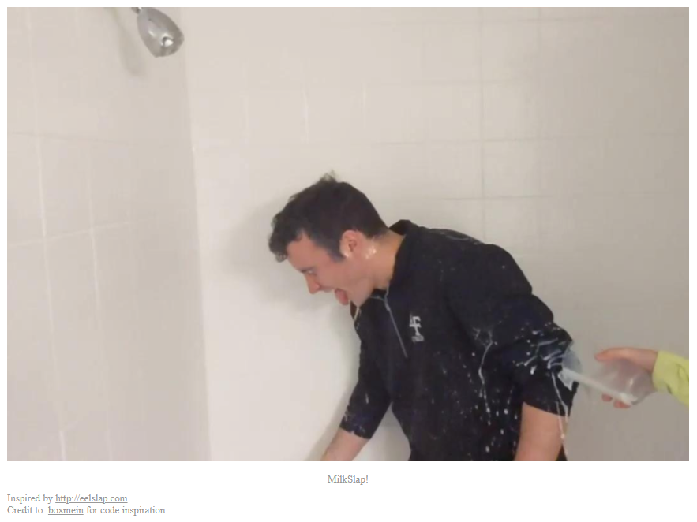

# Milkslap

Category: Forensics
AUTHOR: JAMES LYNCH

**Disclaimer! I do not own any of the challenge files!**

## Description
```
🥛
```

## The link

Yes, that glass of milk is a link. Which shows this:
</br>



</br>

Right, so a gif. Viewed the source:
```html
<!doctype html>

<html lang="en">
<head>
  <meta charset="UTF-8" />
  <meta name="viewport" content="width=400" />
  <title>🥛</title>
  <link rel="stylesheet" href="style.css" />

</head>
<body>
  <div id="image" class="center"></div>
  <div id="foot" class="center">
    <h1>MilkSlap!</h1>
    Inspired by <a href="http://eelslap.com">http://eelslap.com</a> <br>
    Credit to: <a href="https://github.com/boxmein">boxmein</a> for code inspiration.
  </div>
  <script src="script.js">


</script>
</body>
</html>
```
Nothing much, it's probably in the CSS:
```
/* source: milkslap-milkslap.scss */
body {
  margin: 0;
  padding: 0;
  overflow: hidden; }

a {
  color: inherit; }

.center {
  width: 1080px;
  height: 720px;
  margin: 0 auto; }

#image {
  height: 720px;
  margin-top: 5%;
  margin-bottom: 20px;
  background-image: url(concat_v.png);
  background-position: 0 0; }

#foot {
  margin-bottom: 5px;
  color: #999999; }
  #foot h1 {
    font-family: serif;
    font-weight: normal;
    font-size: 1rem;
    text-align: center; }
```
Yes it is! `http://mercury.picoctf.net:29522/concat_v.png` </br>

So not a gif, just concated images. Nice. What can we do with this?

## Stego

So some file identification:
```bash
root@kali:~/CTFs/Picoctf-2021/milkslap-solved# file concat_v.png 
concat_v.png: PNG image data, 1280 x 47520, 8-bit/color RGB, non-interlaced
root@kali:~/CTFs/Picoctf-2021/milkslap-solved# binwalk concat_v.png 

DECIMAL       HEXADECIMAL     DESCRIPTION
--------------------------------------------------------------------------------
41            0x29            Zlib compressed data, default compression
3210141       0x30FB9D        MySQL ISAM compressed data file Version 2
```
Turns out, that binwalk was just confused. It's okay, we've all been there. Since I'm not very good at stego, I looked up John Hammond's repo [ctf-katana](https://github.com/JohnHammond/ctf-katana#steganography) and just went through the tools, some I already installed and could test, some did not work for `.png` files. But one solved it.

## zsteg

zsteg is a ruby based tool (available [here](https://github.com/zed-0xff/zsteg)). Install with `gem install zsteg` and run like so:
```
zsteg -s first concat_v.png 

imagedata           .. text: "\n\n\n\n\n\n\t\t"
b1,b,lsb,xy         .. text: "picoCTF{imag3_m4n1pul4t10n_sl4p5}\n" <-- 
b1,bgr,lsb,xy       .. <wbStego size=9706075, data="\xB6\xAD\xB6}\xDB\xB2lR\x7F\xDF\x86\xB7c\xFC\xFF\xBF\x02Zr\x8E\xE2Z\x12\xD8q\xE5&MJ-X:\xB5\xBF\xF7\x7F\xDB\xDFI\bm\xDB\xDB\x80m\x00\x00\x00\xB6m\xDB\xDB\xB6\x00\x00\x00\xB6\xB6\x00m\xDB\x12\x12m\xDB\xDB\x00\x00\x00\x00\x00\xB6m\xDB\x00\xB6\x00\x00\x00\xDB\xB6mm\xDB\xB6\xB6\x00\x00\x00\x00\x00m\xDB", even=true, mix=true, controlbyte="[">
b2,r,lsb,xy         .. file: SoftQuad DESC or font file binary
b2,r,msb,xy         .. file: VISX image file
b2,g,lsb,xy         .. file: VISX image file
b2,g,msb,xy         .. file: SoftQuad DESC or font file binary - version 15722
b2,b,msb,xy         .. text: "UfUUUU@UUU"
b4,r,lsb,xy         .. text: "\"\"\"\"\"#4D"
b4,r,msb,xy         .. text: "wwww3333"
b4,g,lsb,xy         .. text: "wewwwwvUS"
b4,g,msb,xy         .. text: "\"\"\"\"DDDD"
b4,b,lsb,xy         .. text: "vdUeVwweDFw"
b4,b,msb,xy         .. text: "UUYYUUUUUUUU"
```
There it is :)