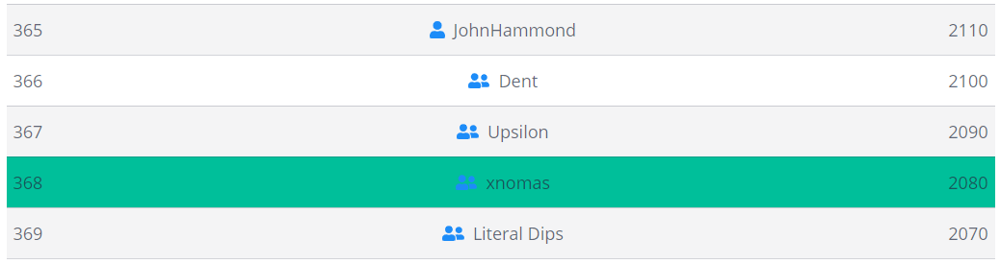

# PicoCTF-2021-Writeups
Writeups for PicoCTF 2021

 
If you see an error please just open an isuse. 

 

## Questions: 
If you have a question we can discuss [here](https://github.com/xnomas/PicoCTF-2021-Writeups/discussions)

 

## How I did:
 

 

In good company <3 (6215 users)
