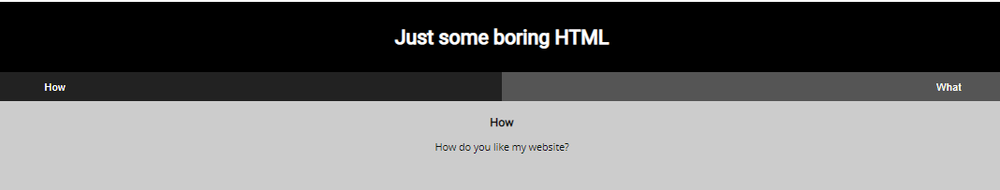
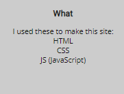

# Scavenger hunt

Category: Web Exploitation </br>
AUTHOR: MADSTACKS

## Description
```
There is some interesting information hidden around this site
```

## Website

Checking out the link I saw this:
</br>



</br>

Interesting. Usually on web ctf challenges I use my scraping tool [webctf](https://github.com/xnomas/web-ctf-help):
```
webctf http://mercury.picoctf.net:27393/

=============
COMMENTS
=============

[+] 1 :   Here's the first part of the flag: picoCTF{t

=============
SCRIPTS
=============

[+] 1 : myjs.js

=============
IMAGES
=============

sources:
--------

alts:
-----

===================
INTERESTING HEADERS
===================


```
Really cool! First part of the flag, so we'll have to `scavenge` around for the next parts. We saw the `How` tab, how about `What`?
</br>



</br>

Right, we checked out the `html` source. How about `javascript` and `css`? In the `webctf` output, we can see a `.js` file. Time to check it out! 

### myjs.js
```js
function openTab(tabName,elmnt,color) {
    var i, tabcontent, tablinks;
    tabcontent = document.getElementsByClassName("tabcontent");
    for (i = 0; i < tabcontent.length; i++) {
	tabcontent[i].style.display = "none";
    }
    tablinks = document.getElementsByClassName("tablink");
    for (i = 0; i < tablinks.length; i++) {
	tablinks[i].style.backgroundColor = "";
    }
    document.getElementById(tabName).style.display = "block";
    if(elmnt.style != null) {
	elmnt.style.backgroundColor = color;
    }
}

window.onload = function() {
    openTab('tabintro', this, '#222');
}

/* How can I keep Google from indexing my website? */
```
That comment! We have to think about how Google can keep track of all these websites? It uses the Google web crawling/spider engine. But since devs don't want these spiders to reach and `index` every part of the website, we use a special file called `robots.txt`! This file tells the crawlers what parts of the site are disallowed, and what User Agents are allower to visit (among other things). Crawlers that listen to these files are called `polite`, when a crawler is not `polite` it could fall into something called a `spider trap`. More on that [here](https://www.techopedia.com/definition/5197/spider-trap).
</br>
After my little tangent, here are the contents of `robots.txt`:
```
User-agent: *
Disallow: /index.html
# Part 3: t_0f_pl4c
# I think this is an apache server... can you Access the next flag?
```
Oh damn! Part 3. Where is part 2?

### mycss.css

The second hint from the `what` tab was the use of css. We can check out the file! 
```css
div.container {
    width: 100%;
}

header {
    background-color: black;
    padding: 1em;
    color: white;
    clear: left;
    text-align: center;
}

body {
    font-family: Roboto;
}

h1 {
    color: white;
}

p {
    font-family: "Open Sans";
}

.tablink {
    background-color: #555;
    color: white;
    float: left;
    border: none;
    outline: none;
    cursor: pointer;
    padding: 14px 16px;
    font-size: 17px;
    width: 50%;
}

.tablink:hover {
    background-color: #777;
}

.tabcontent {
    color: #111;
    display: none;
    padding: 50px;
    text-align: center;
}

#tabintro { background-color: #ccc; }
#tababout { background-color: #ccc; }

/* CSS makes the page look nice, and yes, it also has part of the flag. Here's part 2: h4ts_4_l0 */
```
Very nice indeed. We now have 3 parts of the flag: `picoCTF{th4ts_4_l0t_0f_pl4c`. Now what was that hint in `robots.txt`?

### .htacess
```
# I think this is an apache server... can you Access the next flag?
```
An apache server! What kind of file could that be? Now... in order to be transparent, I had to take a hint here and for the following file from my friend [N1z0ku](https://github.com/N1z0ku). We now need to access the `.htaccess` file! 
```
# Part 4: 3s_2_lO0k
# I love making websites on my Mac, I can Store a lot of information there.
```
Our flag so far: `picoCTF{th4ts_4_l0t_0f_pl4c3s_2_lO0k`.

### .DS_Store

Now, you might be asking yourself: "What the hell? What kind of file is this?!". From what I've read, `.DS_Store` is a special MacOS file that stores information about the current folder. Like icon positioning etc. You may also see it if you unzip a file from a Mac user on a non-Mac computer. Kind of a token identifier of Mac computers.
```
Congrats! You completed the scavenger hunt. Part 5: _d375c750}
```
So here it is! 
## Flag

```
picoCTF{th4ts_4_l0t_0f_pl4c3s_2_lO0k_d375c750}
```
