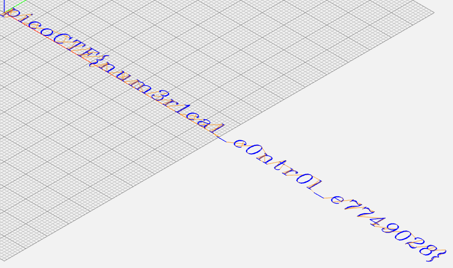
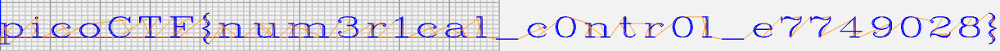

# Speeds and feeds

Category: Reverse Engineering </br>
AUTHOR: RYAN RAMSEYER

## Description
```
There is something on my shop network running at nc mercury.picoctf.net 16524, but I can't tell what it is. Can you?
```

## Netcat

We have a netcat command given... so how about just connect?
```bash
nc mercury.picoctf.net 16524
G17 G21 G40 G90 G64 P0.003 F50
G0Z0.1
G0Z0.1
G0X0.8276Y3.8621
G1Z0.1
G1X0.8276Y-1.9310
G0Z0.1
G0X1.1034Y3.8621
G1Z0.1
G1X1.1034Y-1.9310
G0Z0.1
G0X1.1034Y3.0345
G1Z0.1
G1X1.6552Y3.5862
G1X2.2069Y3.8621
```
Wow, okay... that looks like nonsense. I just redirected the output into a file `output.txt`. Great. How about we take a hint?

## Listening to the hint

`What language does a CNC machine use?` Interesting, time to google it... and turns out it is `G-Code`. Makes sense since everything starts with a `G`. But what now? What use is this to us? Maybe we could google an interpreter?

## Interpreter

I found [this one](https://ncviewer.com/), and it is really handy. After inputting the code, we get this result:
</br>



</br>

</br>



</br>

Great! Here is just plaintext: `picoCTF{num3r1cal_c0ntr0l_e7749028}`