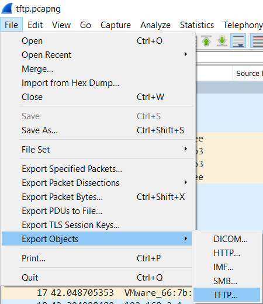
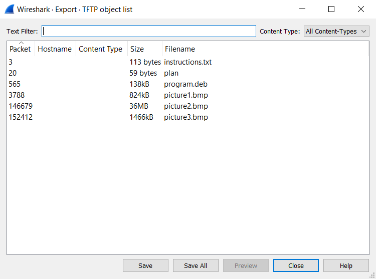

# Trivial Flag Transfer Protocol

Category: Forensics </br>
AUTHOR: DANNY

**Disclaimer! I do not own any of the challenge files!**

## Description
```
Figure out how they moved the flag.
```

## Wireshark

Yet again we have a packet capture file. This is because (as many of you might have guessed) this is a capture of a `TFTP` (Trivial File Transfer Protocol) exchange. This means that the data is exchanged in an unencrypted manner, and this is where wireshark can really come in handy. 
</br>



</br>
Looking through the capture is not needed, we can just extract the exchanged files! (Really neat)
</br>



</br>
So just extract it all, and time to check them out.

## The files
First the instructions!
```
cat instructions.txt
GSGCQBRFAGRAPELCGBHEGENSSVPFBJRZHFGQVFTHVFRBHESYNTGENAFSRE.SVTHERBHGNJNLGBUVQRGURSYNTNAQVJVYYPURPXONPXSBEGURCYNA
```
Well this is probably just [ROT13 again](https://www.boxentriq.com/code-breaking/rot13)
```
GSGCQBRFAGRAPELCGBHEGENSSVPFBJRZHFGQVFTHVFRBHESYNTGENAFSRE.SVTHERBHGNJNLGBUVQRGURSYNTNAQVJVYYPURPXONPXSBEGURCYNA

TFTP DOESNT ENCRYPT OUR TRAFFIC SO WE MUST DISGUISE OUR FLAG TRANSFER. FIGURE OUT A WAY TO HIDE THE FLAG AND I WILL CHECK BACK FOR THE PLAN
```
Right! And we do have tha plan as well:
```
cat plan
VHFRQGURCEBTENZNAQUVQVGJVGU-QHRQVYVTRAPR.PURPXBHGGURCUBGBF
```
More ROT13, yay! 
```
VHFRQGURCEBTENZNAQUVQVGJVGU-QHRQVYVTRAPR.PURPXBHGGURCUBGBF

I USED THE PROGRAM AND HID IT WITH - DUEDILIGENCE. CHECK OUT THE PHOTOS
```
Okay, that is a little weird, but sure. We have abunch of pictures, as well as some `program.deb`. First the pictures:
```
binwalk *.bmp

Scan Time:     2021-03-30 13:24:45
Target File:   /root/CTFs/Picoctf-2021/tftp/picture1.bmp
MD5 Checksum:  64ff3e09f841809a58841fb446299de0
Signatures:    391

DECIMAL       HEXADECIMAL     DESCRIPTION
--------------------------------------------------------------------------------
0             0x0             PC bitmap, Windows 3.x format,, 605 x 454 x 24


Scan Time:     2021-03-30 13:24:46
Target File:   /root/CTFs/Picoctf-2021/tftp/picture2.bmp
MD5 Checksum:  6a38935acc75a8042dee58d7641f437b
Signatures:    391

DECIMAL       HEXADECIMAL     DESCRIPTION
--------------------------------------------------------------------------------
0             0x0             PC bitmap, Windows 3.x format,, 4032 x 3024 x 24
2815484       0x2AF5FC        Broadcom header, number of sections: 793596227,
5539633       0x548731        rzip compressed data - version 87.76 (1415270489 bytes)
6120249       0x5D6339        LANCOM OEM file
8201345       0x7D2481        LANCOM firmware header, model: "QXKRYLQXKQXKQWKOUJNTIKQFIODIODJPELRGMSHMSHMSHLRGJPEHNCIODNTIRXMRXMZbWgqejuinznkwkiuiqxmlmcOPFCD:@@6?>4@?5A>5B?6A>5?<3>;2>;2>;2>;", firmware version: "JPWJ", RC74, build 87 ("OVIPWJQX")
8249741       0x7DE18D        LANCOM firmware header, model: "OVJPXMPXMPXMPXMPXMOWLOWLPXMOWLOWLOWLPXMOWLOWLQYNT\Q[eY]j^arefwjbsf`maWaU=D9/3(8:0:;1AB8=>4>>4=<2<;1<90>;2=:1=:1=:1>;2?<3?<3?<3?<", firmware version: "KPWJ", RC73, build 88 ("NUHOVIQX")
8273945       0x7E4019        LANCOM firmware header, model: "X`UU]RT\QV^SW_TU]RS[PT\QV^SV^SV^S[eYal`eqeduhdxkfzmi}pj|om{odoc`h]T[PAG<:?4:>39:0;:0=<2=<2=<2<90;8/<90?<3A>5@=4?<3?<3>;2=:1>;2?<", firmware version: "TYaV", RC77, build 95 ("PWJRYMT\")
10291544      0x9D0958        Broadcom header, number of sections: 324294729,
12727226      0xC233BA        StuffIt Deluxe Segment (data): fVefVefVefVdeUcdT`aQ_`P``Ra`R`_Q`_QbaScbTebVfbWb^Sa]R_[P[VMTOFQLCTNDYSHWQFWQFWQEWQDWQD[UH_YL`ZM_YL]WJ]WJ\VI]WJ]WJ^XK_YLc]PlfYnh[
13247747      0xCA2503        StuffIt Deluxe Segment (data): fVdeUbcS`aQ_`P_`P``PaaQ``P``P__O__O^^N^^N^^N^^N\\L[[KYYI\ZK]ZK\YJ^[L\YJZWHZWHZWHZVG[VG]XI\WHZUFWRCUPAUPAVQBWRCYTEYTEYTEXSDXSDXSD
13389886      0xCC503E        rzip compressed data - version 89.67 (1263815251 bytes)
13514042      0xCE353A        StuffIt Deluxe Segment (data): fVcdTbdT`cS^aQ\_OSWGPVEJP?KQ@V\KW]LX^M`fUjn^lo_XZJBC3JK;QQAQO@TQBTPAUPASN?RM>UPATO@TO@UPATO@TO@TO@UPAVQBUPAUPAUPAVQBUPATPARO@SPA
13654843      0xD05B3B        HPACK archive data
13840991      0xD3325F        StuffIt Deluxe Segment (data): fVgiYfiYcfVbeUadT_bR\_O\_O_bRadT`cS^aQ\_OZ]M]_O`aQ_`P_`P^_O^^N^^N^^N__O``P`^OebSb_Pc`Qb`Q__O^_O`aQbcScdTcdT^_O[\LUVFTUEWWGXYIWZJ
14459717      0xDCA345        StuffIt Deluxe Segment (data): fV`aQYZJTUEWXHYZJUUESSCWWGYWHZWH\YJa^OeaRa\MUO@[TE]TF[RDXOAaXJ[RDRI;SJ<UL>UL>UL>VM?XOAXOAWN@TK>SJ=UL?WNAUL?RI<QH;TK>VM@WNATK>RI<
14532293      0xDDBEC5        StuffIt Deluxe Segment (data): fV_`PhiYacS[^NUYIW]Lem\[eTckZw}lyzjjgXRM>LE6NE7UL>UL>VM?YPBWN@VM?VM?WN@WN@VM?RI;PG9QH:SJ<TK=TK=UL>WN@UL>TK=UL>VM?VM?UL>TK=SJ<TK=
14908154      0xE37AFA        StuffIt Deluxe Segment (data): fVop`vwguvfpqamn^kl\ttdjgX_ZKZTE^WHb[Lb[L`YJ^WH`YJb[Ld]Nc\Mb[Lb[L`YJ_XIaZKc\Mf_PjcTe^Od]Nf_PaZKc]N^YJXSDYTE\WH\WHSO@TQBb_PspaecT
15451851      0xEBC6CB        rzip compressed data - version 90.73 (1432243550 bytes)
15844847      0xF1C5EF        VMware4 disk image
24952928      0x17CC060       StuffIt Deluxe Segment (data): fdbcaZ[YOPNPQO]^\`a_WXV[\Zefddec^_]OPNMNLXYW`a_mnlmnl\][YZXRSQCDB?@>DEC@A?BCADECCDB:;9897BCACDBEFDFGE675'(&./-<=;;:9;98<:9A?>B@?


Scan Time:     2021-03-30 13:24:58
Target File:   /root/CTFs/Picoctf-2021/tftp/picture3.bmp
MD5 Checksum:  a238337719e294911ad8213e834dc548
Signatures:    391

DECIMAL       HEXADECIMAL     DESCRIPTION
--------------------------------------------------------------------------------
0             0x0             PC bitmap, Windows 3.x format,, 807 x 605 x 24

```
Aaalright, now keep in mind that binwalk can get things wrong. One thing that is important to us is the `rzip compressed data`. What is the `program.deb` anyway?
```
file program.deb 
program.deb: Debian binary package (format 2.0), with control.tar.gz, data compression xz

7z x program.deb

7-Zip [64] 16.02 : Copyright (c) 1999-2016 Igor Pavlov : 2016-05-21
p7zip Version 16.02 (locale=en_US.UTF-8,Utf16=on,HugeFiles=on,64 bits,3 CPUs Intel(R) Core(TM) i7-8550U CPU @ 1.80GHz (806EA),ASM,AES-NI)

Scanning the drive for archives:
1 file, 138310 bytes (136 KiB)

Extracting archive: program.deb
--       
Path = program.deb
Type = Ar
Physical Size = 138310
SubType = deb
----
Path = data.tar.xz
Size = 136868
Modified = 2014-10-14 20:02:56
Mode = -rw-r--r--
--
Path = data.tar.xz
Type = xz
Physical Size = 136868
Method = LZMA2:23 CRC32
Streams = 1
Blocks = 1

Everything is Ok

Size:       460800
Compressed: 138310
```
Lovely! And what is inside `data.tar`?
```
tar xvf data.tar 
./
./usr/
./usr/share/
./usr/share/doc/
./usr/share/doc/steghide/
./usr/share/doc/steghide/ABOUT-NLS.gz
./usr/share/doc/steghide/LEAME.gz
./usr/share/doc/steghide/README.gz
./usr/share/doc/steghide/changelog.Debian.gz
./usr/share/doc/steghide/changelog.Debian.amd64.gz
./usr/share/doc/steghide/changelog.gz
./usr/share/doc/steghide/copyright
./usr/share/doc/steghide/TODO
./usr/share/doc/steghide/HISTORY
./usr/share/doc/steghide/CREDITS
./usr/share/doc/steghide/BUGS
./usr/share/man/
./usr/share/man/man1/
./usr/share/man/man1/steghide.1.gz
./usr/share/locale/
./usr/share/locale/ro/
./usr/share/locale/ro/LC_MESSAGES/
./usr/share/locale/ro/LC_MESSAGES/steghide.mo
./usr/share/locale/fr/
./usr/share/locale/fr/LC_MESSAGES/
./usr/share/locale/fr/LC_MESSAGES/steghide.mo
./usr/share/locale/de/
./usr/share/locale/de/LC_MESSAGES/
./usr/share/locale/de/LC_MESSAGES/steghide.mo
./usr/share/locale/es/
./usr/share/locale/es/LC_MESSAGES/
./usr/share/locale/es/LC_MESSAGES/steghide.mo
./usr/bin/
./usr/bin/steghide
```
Steghide! Now we know what to use on the `.bmp` file! 

## Steghide

Time to get the flag:
```
steghide extract -sf picture2.bmp 
Enter passphrase: 
steghide: could not extract any data with that passphrase!
```
Damn... I tried with no password, but no luck. Maybe some of the previous files could help?
```
VHFRQGURCEBTENZNAQUVQVGJVGU-QHRQVYVTRAPR.PURPXBHGGURCUBGBF

I USED THE PROGRAM AND HID IT WITH - DUEDILIGENCE. CHECK OUT THE PHOTOS
```
Remember this? `DUEDILIGENCE` looks a bit out of place doesn't it? Also `HID IT WITH`, could this be the password? Also no luck... wait, is this the right file?
```
steghide extract -sf picture3.bmp 
Enter passphrase: DUEDILIGENCE
wrote extracted data to "flag.txt".
```
Wohoo! 
```
picoCTF{h1dd3n_1n_pLa1n_51GHT_18375919}
```