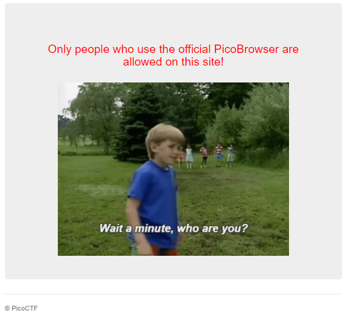
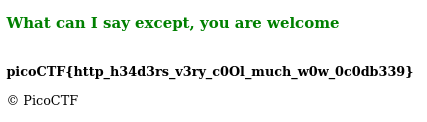

# Who are you?

AUTHOR: MADSTACKS

## Description
```
Let me in. Let me iiiiiiinnnnnnnnnnnnnnnnnnnn
```

## Solving the challenge
Obligatory meme:
</br>


</br>

Now when I opened the link I saw the following:
</br>



</br>

Oh? Any idea how we could specify what browser we are using? Try pressing `Ctrl+Shift+I` and navigating to the `Network` tab, hit reload and look at the `Request Headers` field after clicking on `mercury.picoctf.net` on the left:
```
Accept: text/html,application/xhtml+xml,application/xml;q=0.9,image/avif,image/webp,image/apng,*/*;q=0.8,application/signed-exchange;v=b3;q=0.9
Accept-Encoding: gzip, deflate
Accept-Language: en-US,en;q=0.9,cs;q=0.8
Cache-Control: max-age=0
Connection: keep-alive
Cookie: name=18
Host: mercury.picoctf.net:52362
sec-gpc: 1
Upgrade-Insecure-Requests: 1
User-Agent: Mozilla/5.0 (Windows NT 10.0; Win64; x64) AppleWebKit/537.36 (KHTML, like Gecko) Chrome/89.0.4389.90 Safari/537.36
```
The User-Agent specifies our browser! We can either change this with burp, or you could send a request through `python requests`:
```py
import requests

url = 'http://mercury.picoctf.net:52362'

params = { 'User-Agent' : 'PicoBrowser' }

r = requests.get(url, params=params)

print(r.text)
``` 
But I went the burp route.

## The steps...

After forwarding the request with `User-Agent: PicoBrowser` a new response! (in text from now on)
```
I don't trust users visiting from another site
```
Alright? Paranoid much. Thankfully we can set this with another header! Time to check out the [Mozilla Developer docs](https://developer.mozilla.org/en-US/docs/Web/HTTP/Headers/Referer). In short this allows us the web server to identify where a user is coming from, ie. what website refered us? So our (only modified) headers look like this now:
```
User-Agent: PicoBrowser
Referer: mercury.picoctf.net:52362
```
And another response:
```
Sorry, this site only worked in 2018.
```
Oh! Back to Mozilla! [Here](https://developer.mozilla.org/en-US/docs/Web/HTTP/Headers/Date) are the specifications of the `Date` header, which allows us to set exactly that! Now we send these headers (along with the default headers):
```
User-Agent: PicoBrowser
Referer: mercury.picoctf.net:52362
Date: 2018
```
Response:
```
I don't trust users who can be tracked.
```
Someone really is paranoid. Thankfully we can also set this using a special header. [DNT](https://developer.mozilla.org/en-US/docs/Web/HTTP/Headers/DNT) which stands for Do Not Track indicates if we want to be tracked (*the NSA liked your post*). We do this by setting a numerical value `DNT: 1`. So we send the following:
```
User-Agent: PicoBrowser
DNT: 1
Referer: mercury.picoctf.net:52362
Date: 2018
```
Response:
```
This website is only for people from Sweden.
```
Lovely. How could we go about setting this? Well there is more than one way of finding someone's location on the internet. Maybe through a language preference? Or! Through your IP address. We could just find a public IP address from Sweden! Like this one: 92.34.186.83; which I found [here](https://tools.tracemyip.org/search--country/sweden). We can specify our IP address using the `X-Forwarded-For` header:
```
Host: mercury.picoctf.net:52362
User-Agent: PicoBrowser
DNT: 1
Referer: mercury.picoctf.net:52362
Date: 2018
X-Forwarded-For: 92.34.186.83
```
Response:
```
You're in Sweden but you don't speak Swedish?
```
Now we finally use the language header. Using `Accept-Language` we can specify what we language we would like our webpage to be in. We can even specify the order of importance of these languages! But hey, we want Swedish (skol, am I right?). So how about `Accept-Language: sv-SWE`. Here is the whole request:
```
GET / HTTP/1.1
Host: mercury.picoctf.net:52362
Host: mercury.picoctf.net:52362
User-Agent: PicoBrowser
DNT: 1
Referer: mercury.picoctf.net:52362
Date: 2018
X-Forwarded-For: 92.34.186.83
Accept-Language: sv-SWE
Accept: text/html,application/xhtml+xml,application/xml;q=0.9,image/webp,*/*;q=0.8
Accept-Language: en-US,en;q=0.5
Accept-Encoding: gzip, deflate
Connection: close
Upgrade-Insecure-Requests: 1
Cache-Control: max-age=0
```
And finally the response:
</br>



</br>

```
picoCTF{http_h34d3rs_v3ry_c0Ol_much_w0w_0c0db339}
```