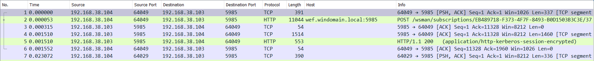
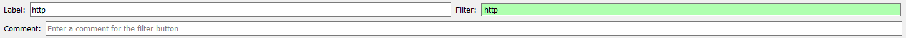
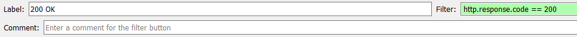
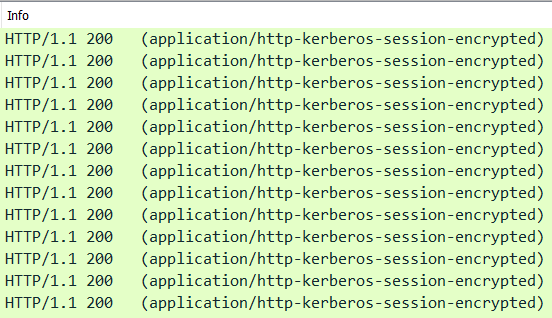
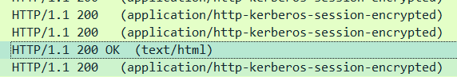
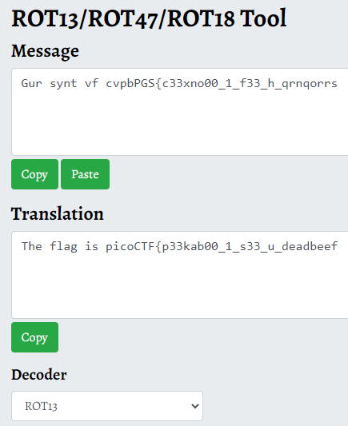

# Wireshark doo dooo do doo...

Category: Forensics </br>
AUTHOR: DYLAN

**Disclaimer! I do not own the challenge files!**

## Description
```
Can you find the flag? shark1.pcapng.
```

## Wireshark

Since we received a `.pcap` file, I opened it up in wireshark. Lets have a look:
</br>



</br>

I can see some `http` traffic. And since my tactic for wireshark in CTFs is to start with this filter:
</br>



</br>

Or even better, with this filer:

</br>



</br>

```
http.response.code == 200
```
This plays perfectly in my hands. Now just to find a good packet stream.
</br>



</br>

Damn! It's all kerberos encrypted traffic.. or is it? Scroll all the way down (with the `200 OK` filter on):
</br>



</br>

Great! Finally something normal! Now just do the following:
</br>


</br>

And this pops out:
```
GET / HTTP/1.1
Host: 18.222.37.134
Connection: keep-alive
Cache-Control: max-age=0
Upgrade-Insecure-Requests: 1
User-Agent: Mozilla/5.0 (Windows NT 10.0; Win64; x64) AppleWebKit/537.36 (KHTML, like Gecko) Chrome/84.0.4147.105 Safari/537.36
Accept: text/html,application/xhtml+xml,application/xml;q=0.9,image/webp,image/apng,*/*;q=0.8,application/signed-exchange;v=b3;q=0.9
Accept-Encoding: gzip, deflate
Accept-Language: en-US,en;q=0.9

HTTP/1.1 200 OK
Date: Mon, 10 Aug 2020 01:51:45 GMT
Server: Apache/2.4.29 (Ubuntu)
Last-Modified: Fri, 07 Aug 2020 00:45:02 GMT
ETag: "2f-5ac3eea4fcf01"
Accept-Ranges: bytes
Content-Length: 47
Keep-Alive: timeout=5, max=100
Connection: Keep-Alive
Content-Type: text/html

Gur synt vf cvpbPGS{c33xno00_1_f33_h_qrnqorrs}
```
And since this is a CTF, how about we just assume this to be ROT13 encoded? An online decoder is enough, like [this one](https://www.boxentriq.com/code-breaking/rot13):
</br>



</br>
Huzzah!